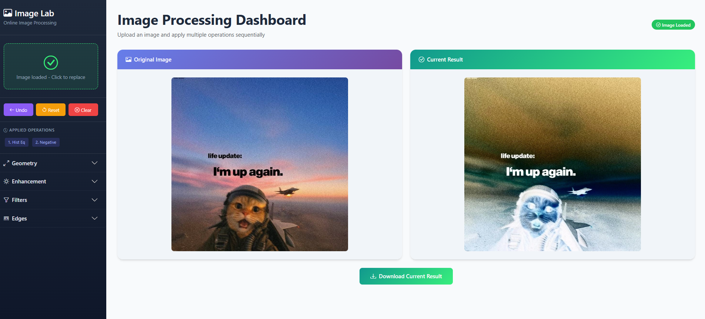
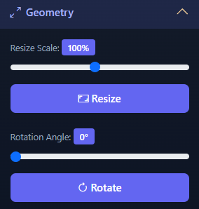
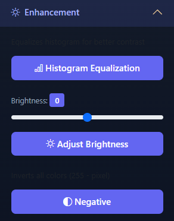
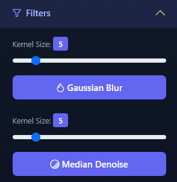
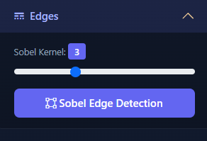

# Online Image Lab

A web-based image processing application demonstrating fundamental computer vision techniques using Python, Flask, and OpenCV.

## Features

### Image Processing Operations

| Category | Operation | Description |
|----------|-----------|-------------|
| **Geometry (Lab 4)** | Resize | Scale image by percentage (10-200%) |
| | Rotate | Rotate image by angle (0-360°) |
| **Enhancement (Lab 5)** | Histogram Equalization | Improve contrast using YUV color space |
| | Brightness | Adjust brightness (-100 to +100) |
| | Negative | Invert colors (255 - pixel) |
| **Filters (Lab 6)** | Gaussian Blur | Smooth image with configurable kernel |
| | Median Denoise | Remove salt-and-pepper noise |
| **Edges (Lab 7)** | Sobel Edge | Detect edges using Sobel operator |
## Screenshots

### main 

### Geometry

### Enhancement

### Filters

### Edges



### Application Features

- **Persistent Sessions**: Upload once, apply multiple operations
- **Operation Chaining**: Apply effects sequentially
- **Undo Support**: Step back through operation history
- **Reset**: Revert to original uploaded image
- **Download**: Save processed results
- **Auto Cleanup**: Temporary files deleted on session clear

## Project Structure

```
ip/
├── app.py              # Flask web server and routes
├── processor.py        # ImageProcessor class with OpenCV operations
├── requirements.txt    # Python dependencies
├── README.md           # This file
├── templates/
│   └── index.html      # Bootstrap 5 dashboard UI
└── static/
    ├── uploads/        # Original uploaded images (temporary)
    ├── working/        # Working images for undo history (temporary)
    └── processed/      # Processed images for download (temporary)
```

## Installation

1. **Clone or navigate to the project directory**

2. **Create a virtual environment (optional but recommended)**
   ```bash
   python -m venv venv
   source venv/bin/activate  # Linux/Mac
   venv\Scripts\activate     # Windows
   ```

3. **Install dependencies**
   ```bash
   pip install -r requirements.txt
   ```

## Usage

1. **Start the server**
   ```bash
   python app.py
   ```

2. **Open in browser**
   ```
   http://localhost:5000
   ```

3. **Workflow**
   - Click the upload area to select an image
   - Choose an operation from the sidebar accordion
   - Adjust parameters using sliders
   - Click the operation button to apply
   - Chain multiple operations as needed
   - Use Undo/Reset/Clear buttons to manage your session
   - Download the final result

## Technical Details

### Backend (Flask)
- Session-based image persistence
- Secure file upload handling
- UUID-based unique filenames
- Automatic temporary file cleanup

### Image Processing (OpenCV)
- `cv2.resize()` - Image scaling
- `cv2.warpAffine()` - Rotation with border handling
- `cv2.equalizeHist()` - Histogram equalization on Y channel
- `cv2.GaussianBlur()` - Gaussian smoothing
- `cv2.medianBlur()` - Median filtering
- `cv2.Sobel()` - Edge detection

### Frontend (Bootstrap 5)
- Responsive dashboard layout
- Accordion menu for tool organization
- Range sliders with live value display
- Side-by-side image comparison
- LocalStorage for accordion state persistence

## API Routes

| Route | Method | Description |
|-------|--------|-------------|
| `/` | GET | Main dashboard page |
| `/upload` | POST | Upload new image |
| `/process` | POST | Apply operation to current image |
| `/undo` | POST | Revert to previous state |
| `/reset` | POST | Reset to original image |
| `/clear` | POST | Clear session and delete files |
| `/download/<filename>` | GET | Download processed image |

## Requirements

- Python 3.8+
- Flask 2.3+
- OpenCV (opencv-python) 4.8+
- NumPy 1.24+

## License

Educational project for image processing demonstration.
